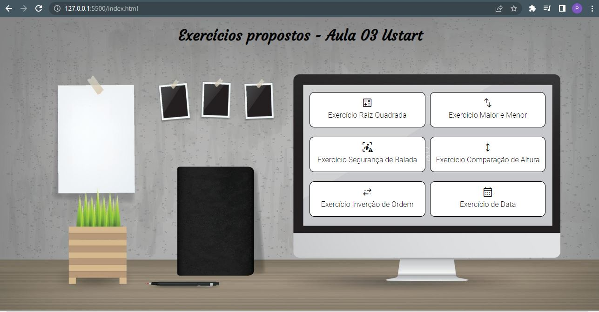

# Exercícios propostos

Criação de uma página web com a resolução de exercícios do Bootcamp Ustart - Aula 03

###

## Enunciado dos exercícios

- [x] Exercício 01: Peça ao usuário para digitar qualquer número em uma caixa de texto e imprima o
número elevado ao quadrado.

- [x] Exercício 02: Peça ao usuário para digitar dois ou mais números em caixas de texto. Verifique
qual é o maior número e exiba-o.

- [x] Exercício 03: Peça ao usuário para digitar várias idades. Exiba quantas pessoas são maior de
idade (20 anos) e quantas são menores.

- [x] Exercício 04: Crie um programa que entre com os dados de altura e sexo de 5 pessoas. Imprima
na tela quantas pessoas são do sexo masculino e quantas pessoas são do sexo feminino. Mostra também qual é a maior altura e se essa altura é de um homem ou uma mulher.

- [x] Exercício 05: Peça ao usuário para digitar vários nomes. Exiba na tela todos os nomes digitados, porém de maneira invertida (do último para o primeiro).

- [x] Exercício 06: Peça para o usuário digitar uma data. Exiba separadamente o dia, o mês e o ano.
(Obs.: não necessita de laço de repetição)

###

## Tarefas

- [x] Criação da página index.html
- [x] Criação das páginas de cada exercício (html)
- [x] Criação dos scripts
  - [x] Página Raiz Quadrada
  - [x] Página Maior e Menor
  - [x] Página Segurança da Balada
  - [x] Página Exercício de Comparação de Altura
  - [x] Página Inverção de Ordem
  - [x] Página Data
- [x] Estilização da página index.html com CSS
- [ ] Estilização das páginas de exercícios com CSS
  - [x] Página Raiz Quadrada
  - [x] Página Maior e Menor
  - [ ] Página Segurança da Balada
  - [ ] Página Exercício de Comparação de Altura
  - [ ] Página Inverção de Ordem
  - [ ] Página Data
- [ ] Finalização do projeto com README.md
